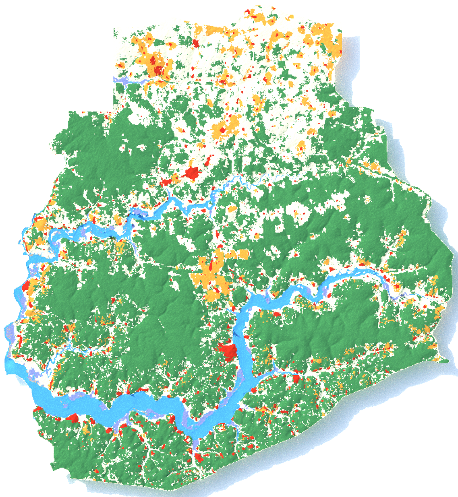
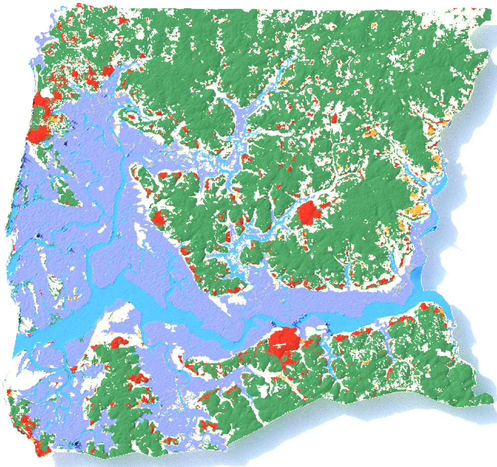

# **3D Land Cover Generation for Senegal States**  

This project generates high-resolution **3D land cover visualizations** for Senegal's regions using satellite imagery. The pipeline integrates raster and vector data, applies terrain analysis, and renders 3D outputs for clear visualization of land cover distributions.

## **Features**
- Processes satellite land cover data using **terra** and **sf** R libraries.
- Generates both **2D land cover maps** and **3D rendered models** for each state.
- Produces PNG outputs for land cover with realistic terrain elevation and lighting using **rayshader**.
- Highly automated pipeline for reproducibility and scalability.

---

## **Project Structure**
```plaintext
.
├── gadm/                # Contains regional shapefiles (.shp) of Senegal states
├── out/                 # Folder for storing generated outputs (land cover PNG files)
├── regions/             # Input shapefiles for each region
├── main.r               # Main R script for pipeline execution
├── land_cover_output.zip  # Compressed output folder for land cover PNGs
└── README.md            # Project documentation (this file)
```

---

## **Dependencies**
The following R libraries are required:
- **terra**: Raster and vector data processing.
- **giscoR**: Access to GIS data.
- **sf**: Spatial data manipulation.
- **tidyverse**: Data wrangling and visualization.
- **ggtern**: Color conversion utilities.
- **elevatr**: Downloading elevation models.
- **png**: Handling PNG outputs.
- **rayshader**: Generating 3D visualizations.
- **magick**: Image processing and annotations.

---

## **How to Run**
1. Clone the repository:
   ```bash
   git clone https://github.com/your_username/3d-landcover-senegal.git
   cd 3d-landcover-senegal
   ```

2. Install dependencies:
   ```R
   install.packages(c("terra", "sf", "tidyverse", "rayshader", "png", "magick", "elevatr", "giscoR", "ggtern"))
   ```

3. Run the main script:
   ```R
   source("main.r")
   ```

4. Generated outputs will appear in the `out/` folder.

---

## **Outputs**
The script produces:
1. **2D Land Cover Maps**:
   - Generated for each Senegalese region based on raster input and shapefiles.

2. **3D Land Cover Visualizations**:
   - High-quality 3D renders with realistic elevation, lighting, and coloring.

---

## **Example Outputs**

### **1. Sedhiou Region**
**Filename**: `land_cover_R_Sedhiou.shp.png`  
  

**Description**:  
This map shows the land cover distribution for the **Sedhiou Region**, featuring realistic elevation data and distinct visualization of land use categories, such as forests and rangelands.

---

### **2. Ziguinchor Region**
**Filename**: `3d_land_cover_Com_Ziguinchor.shp.png`  
  

**Description**:  
The visualization displays land cover types for the **Ziguinchor Region** with 3D effects, highlighting terrain elevation and differentiating land cover categories through color coding.

---

## **Customization**
- Update `COUNTRY_CODE` and `CRS` in the script to adapt to other regions.
- Adjust `rayshader` parameters for elevation scaling and lighting effects.

---

## **License**
This project is licensed under the MIT License.  

---

## **Acknowledgments**
- **ESRI Land Cover**: For satellite land cover rasters.
- **Polyhaven**: HDRI lighting files for 3D rendering.

---

### **Contact**
For questions or contributions, reach out at **losaliou.sl33@gmail.com**.

